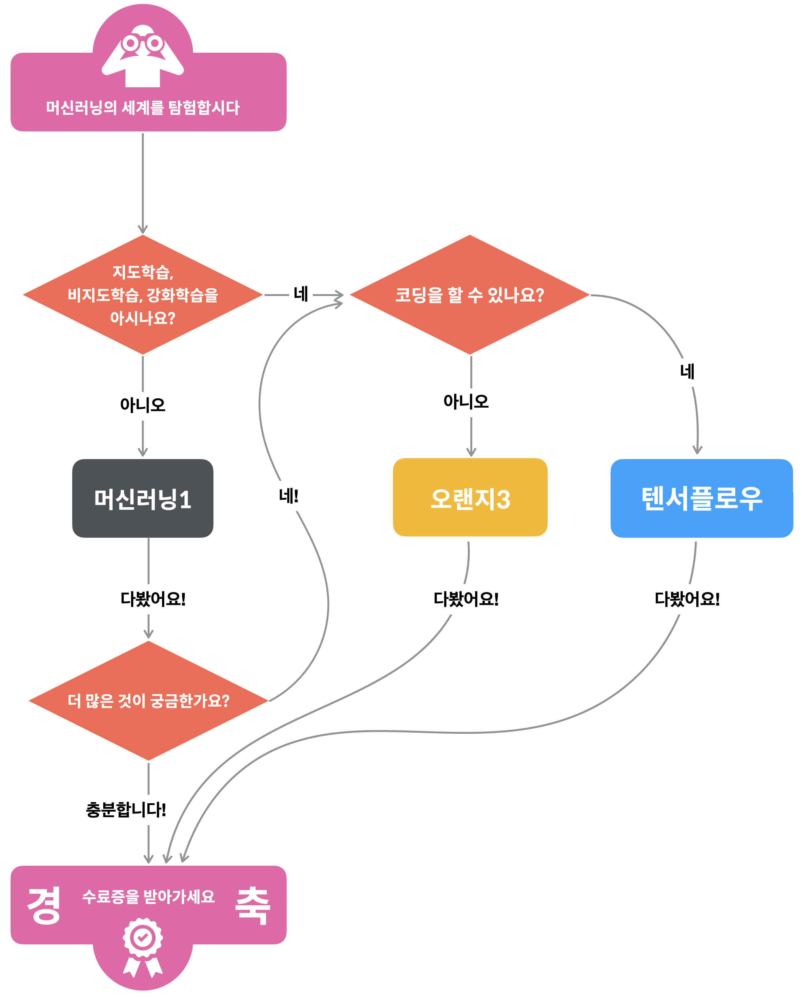

### 머신러닝 야학

------

 [머신러닝 야학](https://ml.yah.ac/)을 들어보자!

2021.1.4부터 2021.1.15까지 온라인으로 무료 수업을 들으면 된다.

아래의 순서도에 따라 나는 `머신러닝1`과 `텐서플로우`를 수강할 예정이다.

수업이 10분 이내로 비교적 짧기 때문에 부담없이 들을 수 있어 좋다. 

또한, 현업에서 활동 중인 엔지니어에게 질문이 가능해 모르는 것은 질문이 가능하다.

다 들어보고 내용을 정리할 예정이다!

