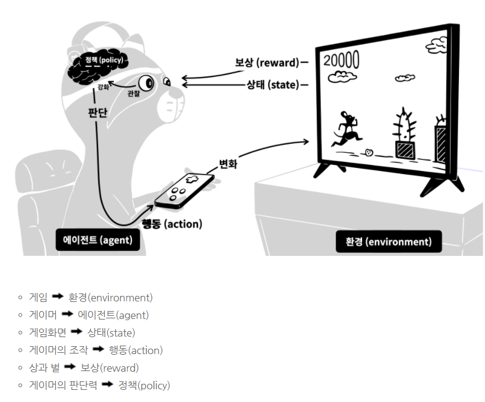
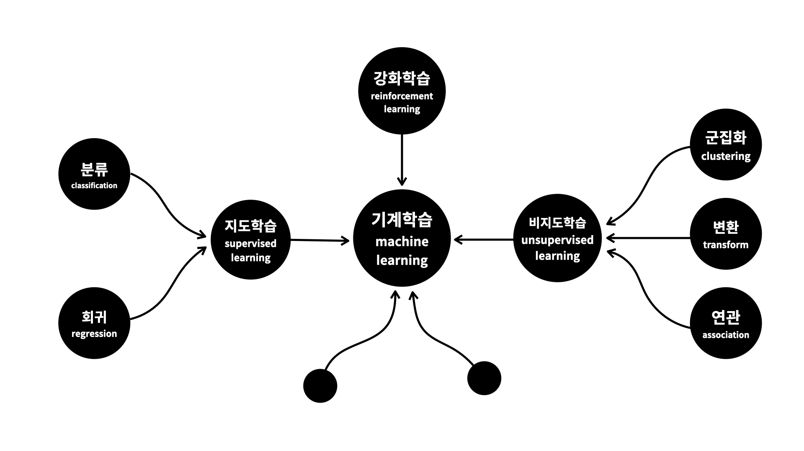

### 머신러닝 야학(머신러닝1)

------

[`머신러닝1`](https://opentutorials.org/course/4548)을 들으면서 내용을 정리해보았다.

###### 1일차

* 머신러닝이란? 두뇌가 가진 판단능력을 확장하여 더 빠르고 정확하게 결정할 수 있도록 돕는 도구 (판단력을 기계에게 부여하는 기술)
* 판단력 = 모델(Model), 모델을 만드는 과정 = 학습(Learning)

###### 2일차

* 학습 완료

###### 3일차

* 1-12 표
  * Dataset은 표를 의미한다.
  * 표는 행(row)와 열(column)로 이루어진다.
  * 행(row)은 개체(instance), 관측치(observed value), 기록(record), 사례(example), 경우(case)라고 불린다.
  * 열(column)은 특성(feature), 속성(attribute), 변수(variable), 필드(field)라고 불린다.
* 1-13 독립변수와 종속변수
  * 독립변수(원인), 종속변수(결과)
  * 상관관계 : 서로 상관 있는 특성들의 관계를 의미
  * 인과관계 : 독립변수(원인)와 종속변수(결과)의 관계를 의미
  * 인과관계는 상관관계에 포함된다.

###### 4일차

* 1-15 머신러닝 분류
  * 지도학습(supervised learning) : 정답이 있는 문제를 해결하는 것
    * 분류(classification)
    * 회귀(regression)
  * 비지도학습(unsupervised learning) : 통찰을 통해 새로운 의미나 관계를 밝혀내는 것
    * 군집화(clustering)
    * 변환(transform)
    * 연관(associate)
  * 강화학습(reinforcement learning) : 더 좋은 보상을 받기 위해서 수련하는 것
* 1-16 지도학습
  * 지도학습이란?   과거의 데이터로부터 학습해서 결과를 예측하는 것
  * 학습을 위한 충분히 데이터가 많아야함
  * 데이터는 독립변수와 종속변수로 이루어져 있어야함
* 1-17 회귀
  * 예측하고 싶은 **종속변수가 숫자**일 때, **회귀(regression)**를 사용
* 1-18 분류
  * 예측하고 싶은 **종속변수가 이름(문자)**일 때, **분류(classification)**를 사용
* ⭐정리
  * 가지고 있는 데이터가 독립변수와 종속변수가 있고, 종속변수가 숫자일 때, 회귀를 이용
  * 가지고 있는 데이터가 독립변수와 종속변수가 있고, 종속변수가 이름일 때, 분류를 이용
* 추가_양적 데이터와 범주형 데이터
  * 양적(Quantitative) : 얼마나 큰지, 얼마나 많은지, 어느 정도인지를 의미하는 데이터(=숫자) => 회귀
  * 범주(Categorical) : 같은 특성을 지닌 부류나 범위(=이름) =>분류

###### 5일차

* 1-19 군집화(clustering)

  * 군집화란?  비슷한 것들을 찾아서 그룹을 만드는 것( = 관측치(행)을 그룹핑 해주는 것)
  * 군집화는 어떤 대상을 구분해 그룹을 만드는 것이라면, 분류는 어떤 대상이 어떤 그룹에 속하는지를 판단하는 것

* 1-20 연관 규칙 학습(association rule learning)

  * 연관규칙학습이란?  특성(열)을 그룹핑 해주는 것

* 1-21 비지도학습(unsupervised learning)

  * 비지도학습이란?  데이터를 정리 정돈해서 데이터의 성격을 파악하는 것

  * 비지도학습 vs 지도학습

    | 비지도학습   | 탐험     | 변수 \| 변수 \| 변수   |
    | ------------ | -------- | ---------------------- |
    | **지도학습** | **역사** | **독립변수, 종속변수** |

  * 비지도학습은 탐험적으로 데이터들의 성격을 파악한다. 이로 데이터가 존재하면된다,

  * 지도학습은 역사적으로 원인과 결과를 바탕으로 모르는 원인이 발생한 경우 결과를 추측하는 것이 목표이다. 그래서 원인이 독립변수와 결과인 종속변수가 필요하다.

* 추가_변환(transform)

  * 변환이란?  데이터를 새롭게 표현해 원래 데이터보다 더 쉽게 사용자가 볼 수 있게 도와주는 기법
  * 주로 데이터의 차원축소(dimensionality reduction), 데이터셋 시각화가 대표적인 사례
  * 또한, 데이터를 구성하는 단위나 성분을 찾고 텍스트 문서에서 주제를 추출하는 것이 예시이다.

* 1-22 강화학습(reinforcement learning)]

  * 강화학습이란?  더 많은 보상을 받을 수 있는 정책을 만드는 것

  

###### 6일차

* 머신러닝 종류 정리

* 머신러닝 지도(모든 상황에 통용되는 것은 아니지만 흐름을 파악할 때 사용)

깔끔하고 이해하기 쉽게 만든것 같다. 이제 텐서플로우를 들어볼 예정이다.

* 모든 사진은 머신러닝 야학에서 발췌하였다. [기여자](https://opentutorials.org/course/4548/28953)에 들어가보면 교육을 만드는 데 도움을 주신분들을 확인해볼 수 있다.