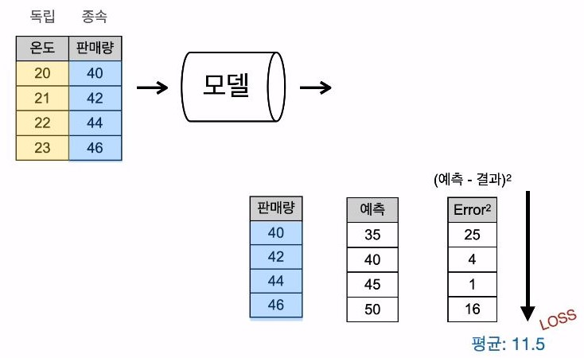
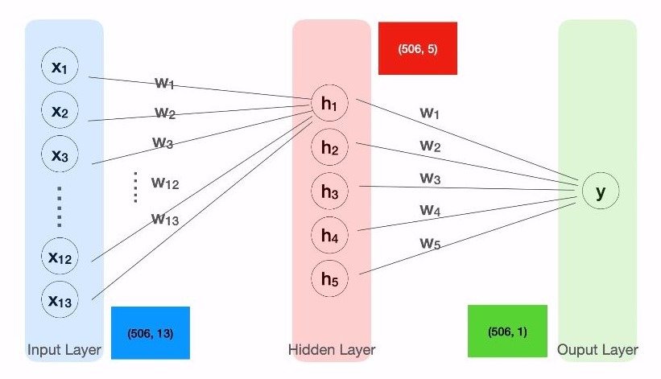

### 머신러닝 야학(텐서플로우101)

------

[`텐서플로우101`](https://opentutorials.org/course/4966)을 들으면서 내용을 정리해보았다.

###### 1일차

* 101-1 오리엔테이션
  * Neural Network(= 인공신경망, 딥러닝)
  * 사람의 두뇌가 동작하는 방법을 모방해서 기계가 학습을 할 수 있도록 고안된 알고리즘
  * 라이브러리란? 딥러닝 프로그램을 쉽게 구현할 수 있도록 다양한 기능을 제공해 주는 것
  * 종류 : **텐서플로우**, 파이토치, 카페, 티아노

* 101-2 목표와 전략

* 101-3 지도학습의 빅픽쳐

* 101-4 환경설정-Google Colaboratory

###### 2일차

* 101-5 표를 다루는 도구 '판다스'
  - 변수(variable) : 하나의 데이터를 저장할 수 있는 메모리 공간
  - 표에서는 컬럼 헤더를 변수라고 함
  - 원인(독립변수), 결과(종속변수) => 지도학습은 독립변수와 종속변수를 분리해야함

* 101-6 표를 다루는 도구 '판다스'(실습)
  * 표를 다루는 도구 판다스.ipynb
  * 파일 읽어오기 : pd.read_csv('경로/파일명.csv')
  * 모양 확인하기 : print(data.shape)
  * 칼럼 선택하기 : data[['칼럼명1','칼럼명2','칼럼명3']]
  * 칼럼 이름 출력하기 : print(data.columns)
  *  맨 위 5개 관측치 출력하기 : data.head()

* 101-7 레모네이드 판매 예측

  

  ###### 1. 과거의 데이터를 준비합니다.

  * 데이터를 읽어온 후 pandas를 사용해 독립변수와 종속변수를 나눈다.

  ###### 2. 모델의 구조를 만듭니다.

  - tensorflow를 사용해 모델을 만든다.
  - Input의 shape과 Output의 shape은 데이터의 입력인 독립변수와 출력인 종속변수의 shape에 맞춰 작성한다.

  ###### 3. 데이터로 모델을 학습(FIT)합니다.

  - epochs : 전체 데이터를 몇 번 반복하여 학습할 것인지 결정하는 숫자

  ###### 4. 모델을 이용합니다.

  - model.predict([새로운 입력값])을 통해 모델을 이용

  

* 101-8 손실의 의미

  

  * loss : 모델의 출력값과 정답의 오차를 정의하는 함수
  * loss가 0에 가까울수록 학습이 잘된 경우
  * mse(mean square error) : (예측 - 결과)^2

* 101-9 레모네이드 판매 예측(실습)
  
  * 실습2-레모네이드 판매 예측

###### 3일차

* 101-10 보스턴집값 예측
  * 이상치 : 전체 집단의 수치와 비교하여 상이하게 높거나 낮아서 평균의 대표성을 무너트리는 값
  * 데이터의 대표값으로 주로 사용되는 값은 '평균값', '중앙값'
* 101-11 수식과 퍼셉트론

* 101-12 보스턴 집값 예측 실습
  * 실습3 - 보스턴 집값 예측
* 101-13 학습의 실제
  * 직접 엑셀로 값을 바꾸면서 해보니까 딥러닝의 원리를 알 수 있음

###### 4일차

* 101-14 아이리스 품종 분류
  * 종속변수가 양적 데이터인 경우 → 회귀 / 종속변수가 범주형 데이터인 경우 → 분류
* 원핫인코딩
  * 원핫인코딩이란? 범주형 데이터를 1과0의 데이터로 바꾸는 과정을 의미
  * 분류 모델에서는 범주형 데이터를 원핫인코딩을 통해 수치로 변환
  * \# 원핫인코딩 변환 코드
  * iris = pd.get_dummies(iris)
* 101-16 소프트맥스
  * 비율로 예측하기 위해 softmax 사용
  * 분류에 사용하는 loss : crossentropy(categorical_crossentropy) / 회귀에 사용하는 loss : mse
  * 분류 모델은 loss보다도 정확도로 파악 (metrics='accuracy')
* 추가_활성화함수(종류&사용법)
  * Sigmoid
    * output의 값을 0~1사이로 만들어준다.
    * vanishing gradient 현상 : input값이 너무 크거나 작아지면 기울기가 거의 0이 됨
    * 대부분의 경우 성능이 좋지 않아 잘 사용하지 않는다. 하지만 Binary classification의 경우 출력층의 노드가 1개이므로, 0~1사이의 값을 가져 마지막 cast를 통해(ex, 0.5이상이면 1, 미만이면 0) 1 or 0값을 Output으로 받을 수 있다.
  * Tanh
    * output의 값을 -1~1사이로 가지며 데이터의 평균이 0이다.
    * sigmoid보다 tanh이 성능이 더 좋다.
    * vanishing gradient 현상 존재
  * ReLU
    * 가장 성능이 좋아 많이 사용한다.
    * 대부분의 input값에 대해 기울기가 0이 아니기 떄문에 학습이 빨리 된다.
    * input이 음수인 경우 기울기가 0이다.
  * leakyReLU
    * ReLU와 비슷하지만, input값이 음수인 경우 기울기가 0이 아닌 0.01을 갖기때문에 학습이 더 잘 된다.
  * Softmax
    * input값을 0~1가이의 출력이 되도록 정규화하여 출력값들의 총합이 항상 1이되는 특성을 지닌다.
    * 주로 확률적 classification을 할 때 용이하게 사용된다.
  * Identity Function(항등함수)
    * 양극성이며 입력값의 가중합이 그대로 출력된다.
  * Swish
    * ReLU를 대체하기 위해 구글이 고안한 함수
    * 시그모이드 함수에 x를 곱한 간단한 형태이다.
    * 깊은 레이어를 학습시킬 때 ReLU보다 더 뛰어난 성능을 보여주고 있다.
* 추가_loss함수(종류&사용법)
  * MAE(Mean Absolute Error)
    * 에러 절대값의 평균을 구한다
    * 주로 회귀모델에 사용
  * MSE(Mean Squared Error)
    * (예측값 - 실제값)^2 의 평균
    * 제곱하는 이유는 오차가 음수인 경우 오차의 합산에서 의미가 달라지기 때문이다(ex. -5 + 5 = 0 )
    * 제곱으로 인해 오차가 양수이든 음수이든 누적 값을 증가시킨다.
    * 주로 회귀 모델에 사용
  * RMSE(Root Mean Squared Error)
    * MSE와 기본적으로 동일하되 루트를 추가한 것이다.
    * MSE는 오류의 제곱을 구하기 때문에 실제 오류 값보다 커지는 경향이 있어 루트를 통해 값의 왜곡을 줄여준다.
  * Binary crossentropy
    * 주로 이진 분류모델에 사용
    * 2개의 클래스를 가진 경우 사용
  * Categorical crossentropy
    * 멀티클래스 분류에 사용
    * 종속변수가 [1, 0, 0], [0, 1, 0], [0, 0, 1]과 같이 one-hot의 형태로 제공될 때 사용
  * Sparse categorical crossentropy
    * 멀티클래스 분류에 사용
    * 종속변수가 0, 1, 2, 3, 4와 같이 정수의 형태로 제공될 때 사용

###### 5일차

* 101-18 히든레이어
  * 딥러닝(인공신경망) : 각각의 모델을 연속적으로 연결하여 하나의 거대한 신경망을 만드는 것

* 101-19 히든레이어 실습
  * 실습5-멀티레이어
* 101-20 데이터를 위한 팁
  * 변수(칼럼) 타입 확인 : 데이터.dtypes
  * 변수를 범주형으로 변경 :
    * 데이터['칼럼명'].astype('category')
  * 변수를 수치형으로 변경 :
    * 데이터['칼럼명'].astype/('int')
    * 데이터['칼럼명'].astype/('float')
  * NA 값의 처리
    * NA 갯수 체크 : 데이터.isna().sum()
    * NA 값 채우기 : 데이터['칼럼명'].fillna(특정숫자)  

* 101-21 모델을 위한 팁
  * tf.keras.layers.BatchNormalization() : Dense와 Activation 레이어 사이에 두는게 가장 효과적
  * tf.keras.layers.Activation('swish')

* 모든 사진은 머신러닝 야학에서 발췌하였다. [기여자](https://opentutorials.org/course/4548/28953)에 들어가보면 교육을 만드는 데 도움을 주신분들을 확인해볼 수 있다.