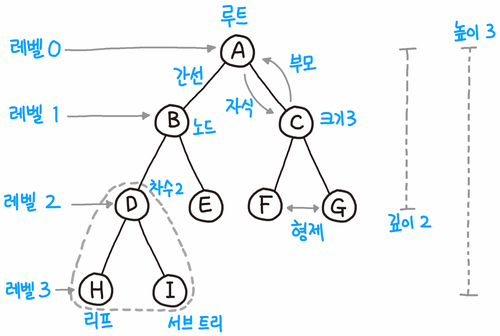
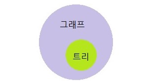
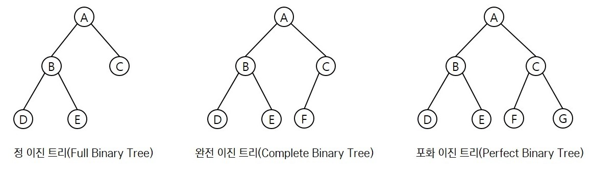

### 트리(Tree)

---

> 계층형 트리 구조를 시뮬레이션 하는 추상 자료형(ADT)으로, 루트 값과 부모-자식 관계의 서브트리로 구성되며, 서로 연결된 노드의 집합이다.

* 부모-자식 관계
* 트리는 재귀로 정의된 자기 참조 자료구조이다. 

 

#### 트리의 각 명칭

----

* 트리는 루트(Root)부터 시작하며, 루트는 자식 노드(Child)와 간선(Edge)으로 연결됨
* 리프(Leaf)노드는 자식 노드가 없는 노드를 의미. 단말 노드라 불림
* 차수(Degree)는 자식 노드의 개수를 의미
* 크기(Size)는 자신을 포함한 모든 자식 노드의 개수
* 높이(Height)는 가장 긴 루트 경로의 길이
* 깊이(Depth)는 루트에서부터 현재 노드까지의 거리
* 트리는 그 자식도 트리인 서브트리(Subtree)구성을 가짐
* 레벨(Level)은 0부터 시작
* 내부 정점(Internal vertex)은 차수가 2 이상인 정점을 뜻함
* 포레스트(Forest)는 서로 독립인 트리들의 모임을 의미

 

#### 그래프 vs 트리

----

그래프와 트리의 가장 큰 차이점은 **`트리는 순환 구조를 갖지 않는 그래프`**이다.

트리도 그래프라 볼 수 있지만, 그래프는 트리라 볼 수 없다.

정리하면,

* 트리는 부모 노드에서 자식 노드를 가리키는 단방향 그래프이다.
* 사이클(순환 구조)를 존재하지 않는다.
* 트리는 하나의 부모 노드를 갖는다.(루트가 하나이다.)

 

#### 이진트리(Binary Tree)

----

> 부모 노드 밑 자식 노드 개수(=차수)를 최대 2개로 제한하는 트리

##### 이진 트리 유형

* 정 이진 트리 : 모든 노드가 0개 또는 2개의 자식 노드를 갖는다.
* 완전 이진 트리 : 마지막 레벨을 제외하고 모든 레벨이 완전히 채워져 있으며, 마지막 레벨의 모든 노드는 가장 왼쪽부터 채워져 있다.
* 포화 이진 트리 : 모든 노드가 2개의 자식 노드를 갖고 있으며, 모든 리프 노드가 동일한 깊이 또는 레벨을 갖는다. 