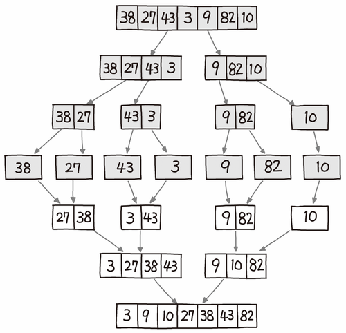
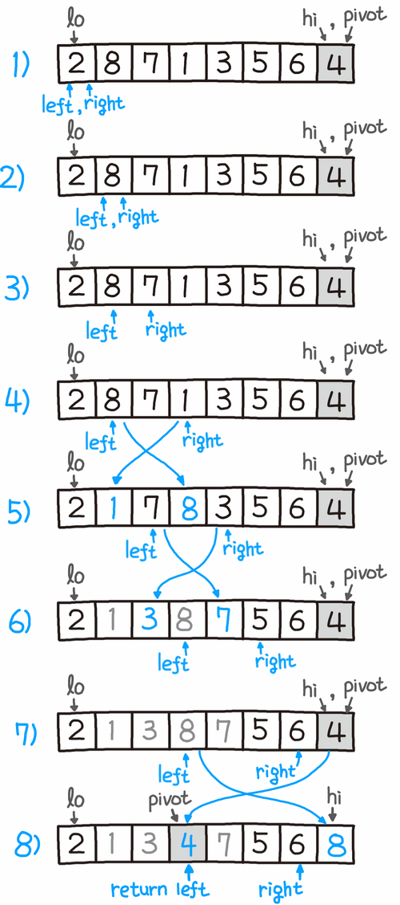
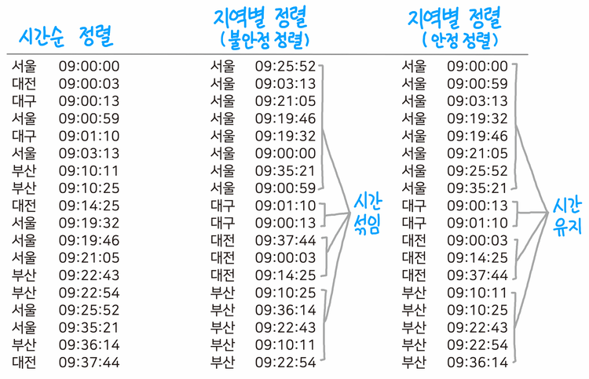

* 정렬 알고리즘 추가할 예정!

### 정렬(Sort)

---

> 정렬 알고리즘은 목록의 요소를 특정 순서대로 넣는 알고리즘이다. 대개 숫자식 순서와 사전식 순서로 정렬한다.

<br>

### O(n²) 

#### 버블 정렬(Bubble Sort)

---

> 서로 인접한 두 원소를 검사하여 정렬하는 알고리즘

코드

```python
def bubblesort(A):
    for i in range(1, len(A)):
        for j in range(0, len(A) - 1):
            if A[j] > A[j + 1]:
                A[j], A[j + 1] = A [j + 1], A[j]
    return A
```

<br>

#### 선택 정렬(Selection Sort)

---

> 

코드

```python

```

<br>

#### 삽입 정렬(Insertion Sort)

---

> 

코드

```python

```

<br>

### O( n log n )

#### 병합 정렬(Merge Sort)

---

>정렬되지 않은 전체 데이터를 하나의 단위로 분할한 후 분할한 데이터들을 다시 병합하며 정렬하는 방식



```python
def merge(left, right):
    result = []
    while len(left) > 0 or len(right) > 0:
        if len(left) > 0 and len(right) > 0:
            if left[0] <= right[0]:
                result.append(left[0])
                left = left[1:]
            else:
                result.append(right[0])
                right = right[1:]
        elif len(left) > 0:
            result.append(left[0])
            left = left[1:]
        elif len(right) > 0:
            result.append(right[0])
            right = right[1:]
    return result

def merge_sort(A):
    if len(A) <= 1:
        return A
    mid = len(A) // 2
    leftList = A[:mid]
    rightList = A[mid:]
    leftList = merge_sort(leftList)
    rightList = merge_sort(rightList)
    return merge(leftList, rightList)
```

<br>

#### 퀵 정렬

----

>피벗(pivot)을 기준으로 작은 값은 왼쪽 큰 값은 오른쪽으로 나누는 정렬



코드

```python
def quicksort(A, lo, hi):
    def partition(lo, hi):
        pivot = A[hi]
        left = lo
        for right in range(lo, hi):
            if A[right] < pivot:
                A[left], A[right] = A[right], A[left]
                left += 1
        A[left], A[hi] = A[hi], A[left]
        return left

    if lo < hi:
        pivot = partition(lo, hi)
        quicksort(A, lo, pivot - 1)
        quicksort(A, pivot + 1, hi)
```

<br>

#### 힙 정렬(Heap Sort)

---

> 

코드

```python

```

<br>

### 하이브리드 정렬

#### 팀 정렬(Tim Sort)

---

> 

코드

```python

```

<br>

### 안정 정렬 vs 불안정 정렬

---



> 안정 정렬 알고리즘은 중복된 값을 입력 순서와 동일하게 정렬한다.
>
> 대표적으로 병합 정렬과 버블 정렬은 안정 정렬이고, 퀵 정렬은 불안정 정렬이다.

### 정렬 알고리즘 시간복잡도

---

| 알고리즘  | 시간 복잡도      | 공간 복잡도 | 안정성 |
| --------- | ---------------- | ----------- | ------ |
| 선택 정렬 | O(n²)            | 0           | Y      |
| 삽입 정렬 | O(n²)            | 0           | Y      |
| 버블 정렬 | O(n²)            | 0           | Y      |
| 쉘 정렬   | O(n1.5)          | 0           | N      |
| 퀵 정렬   | O(nlogn) ~ O(n²) | 2n+2        | N      |
| 힙 정렬   | O(nlogn)         | 0           | N      |
| 병합 정렬 | O(nlogn)         | n           | Y      |

