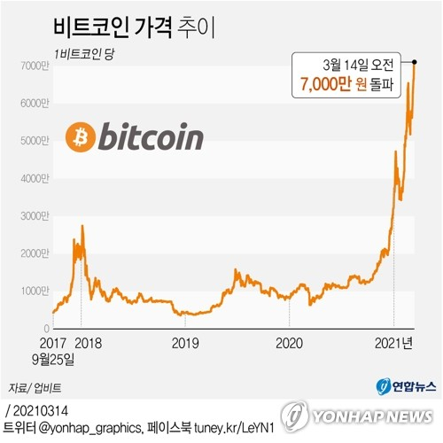

## 2021. 03. 15 뉴스 스크랩

<br>
<br>

### 암호화폐 하루 거래액, 코스피 넘어섰다

---

>  비트코인 개당 7,000만원 돌파 속
>
> 국내 4곳서 총 16.7조 거래 신기록
>
> 인플레 우려에 안전 투자처 기대감



비트코인 가격이 사상 처음으로 개당 7,100만 원을 넘어섰다. 비트코인의 상승세에 투자자들의 매수가 이어지면서 국내 암호화폐 시장 거래액이 코스피시장 하루 평균 거래액도 돌파했다.

14일 암호화폐거래소 업비트에 따르면 비트코인은 이날 오후 4시 기준 7,060만 원을 기록했다. 비트코인은 이날 오전 7,000만 원을 넘어서며 가격이 천정부지로 치솟았다. 업비트에서 비트코인은 오전 5시 24분 7,000만 원을 넘은 데 이어 오전 8시 45분에는 7,100만 원을 찍었다. 다른 거래소인 빗썸에서도 비트코인은 오전 5시 13분 처음으로 7,000만 원을 기록했다. 비트코인은 대부분의 거래소에서 오후에도 7,000만 원 선에 거래됐다. 암호화폐는 주식시장과 달리 거래소 단위로 거래가 이뤄져 같은 종류라도 거래소별로 거래 가격이 다소 다르다.

<br>

비트코인 가격이 급등하면서 한때 총 암호화폐 거래액이 국내 주식시장 거래액을 넘어서기도 했다. 글로벌 암호화폐 시황 중계 사이트인 코인마켓캡에 따르면 이날 오전 3시 기준 국내 주요 4대 거래소의 지난 24시간 거래액은 총 16조 6,947억 원을 기록했다. 3월 코스피 하루 평균 거래액(16조 459억 원), 코스닥 하루 평균 거래액(11조 4,126억 원)을 넘어서는 수준이다.

업계에서는 최근 인플레이션 우려가 커지면서 비트코인이 안전한 투자처가 될 수 있다는 기대감이 높아졌다고 분석했다. 조 바이든 미국 대통령이 지난 12일 1조 9,000억 달러에 이르는 경기부양책에 서명하면서 현금 가치가 떨어질 것으로 보고 투자자들이 새로운 투자처를 모색한 결과라는 것이다.

기업들이 수요를 부추기는 점도 가격 급등의 주요인으로 꼽힌다. 비트코인은 지난해 10월 미국 온라인 결제 업체 페이팔이 암호화폐를 결제 수단으로 사용할 수 있도록 하겠다고 발표한 후 상승세가 본격화됐다. 이어 미국 전기자동차 업체 테슬라에서도 지난달 비트코인 15억 달러어치를 구매하고 결제 수단으로 허용하겠다고 밝힌 바 있다. 이 외에도 중국에서 설립된 최대 뷰티앱 업체 메이투와 블랙록·골드만삭스 등 금융회사들도 비트코인에 투자하고 있다.

<br>

출처 : https://www.sedaily.com/NewsView/22JTF0D0OE/GC13

<br>

**요약**

```text
비트코인 가격이 개당 7100만원을 넘음
비트코인 가격이 급등하면서 암호화폐 거래액이 코스피 하루 평균 거래액(16조 459억원)을 넘어선 16조 6,947억원을 기록함

인플레이션 우려가 커지면서 비트코인이 안전한 투자처가 될 수 있다는 기대감에서 비롯된 것이라고 분석
조 바이든 대통령이 경기부양책을 추진하며 현금 가치가 떨어질 것을 보고 새로운 투자처를 모색한 결과라고 분석
또한, 기업들이 수요를 부추기는 점도 주요인이다. 최근 페이팔(미국 온라인 결제 업체)에서 암호화폐를 결제 수단으로 허용했고, 테슬라(미국 전기자동차 업체)에서도 비트코인 15억 달러를 구매하고 결제수단으로 허용함
```

<br>

**용어 정리**

```text
암호화폐 : 분산 장부에서 공개키 암호화를 통해 안전하게 전송하고, 해시 함수를 이용해 쉽게 소유권을 증명해 낼 수 있는 가상자산
인플레이션(물가 상승) : 한 국가의 재화와 용역 가격 등의 전반적인 물가가 지속적으로 상슨하는 경제 상태
경기부양책 : 가라앉은 경기를 떠오르게 하는 대책이나 방법으로 대규모 토건, 양적완화정책을 통한 경기 활성화 정책 
양적완화 : 중앙은행의 정책으로 금리 인하를 통한 경기부양 효과가 한계에 봉착했을 때 중앙은행이 국채매입 등을 통해 유동성을 시중에 직접 푸는 정책
```


