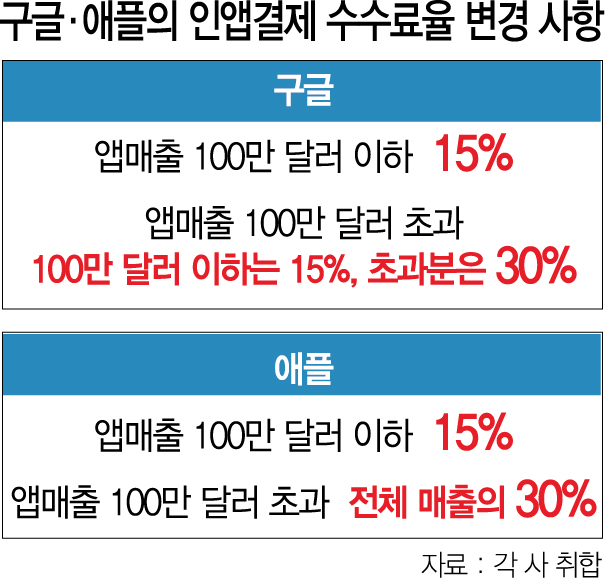

## 2021. 03. 16 뉴스 스크랩

<br>
<br>

### '큰손'된 2030 덕에···돈 몰리는 명품 플랫폼

---

> 트렌비, 220억 C라운드 투자 받아
>
> 3년만에 400억 투자 유치
>
> 발란도 네이버 손잡고 급성장

명품 소비의 주력 계층이 2030세대 등으로 옮겨지면서 온라인을 통해 명품을 구매할 수 있는 명품 구매 플랫폼의 몸값도 높아지고 있다. 트렌비는 3년만에 약 400억 원의 투자를 이끌어냈고 발란의 경우 네이버로부터 투자를 받아 네이버의 명품 카테코리 확장의 선봉에 서는 등 도도했던 명품 시장을 온라인 영역으로 끌어내는 데 앞장서고 있다.

15일 명품 플랫폼 트렌비는 약 220억 원의 C라운드 투자를 유치했다고 밝혔다. 이번 C라운드 투자에는 기존 투자자인 IMM인베스트먼트, 뮤렉스파트너스, 한국투자 파트너스에 더해 신규 투자자 에이티넘 인베스트먼트가 참여했다. 트렌비는 2019년 시리즈A 투자를 시작으로 3년 만에 누적 투자액 400억 원을 달성하게 됐다. 통상 C라운드 투자는 스타트업이 성공 궤도에 안착했음을 의미한다. 트렌비 관계자는 “성장 가능성을 다시 한 번 공식적으로 인정받았다”고 설명했다.

트렌비는 2017년 2월 첫 서비스 개시 이후 약 4년 만에 월간 활성 사용자 수(MAU·Monthly Active Users)가 450만 명, 월 거래액 150억 원을 달성했다. 특히 지난해 7월 110억 원의 시리즈B 투자를 유치한지 7개월 만에 2배 성장을 기록하기도 했다. 박경훈 트렌비 대표는 “이번 투자금을 기반으로 해외 진출과 신규사업을 강화하고, 인재 영입을 위해서 박차를 가할 예정”이라며 향후 계획을 발표했다.

<br>

발란 역시 네이버와 손을 잡으며 명품 플랫폼의 대표 주자로 성장했다. 럭셔리 패션의 이커머스 활성화를 위해 브랜드 확대, 도·소매상의 온라인 판로 개척, B2B 사업지원, 풀필먼트 (통합물류대행) 서비스, IT 인프라 제공 등의 사업을 진행하고 있다. 발란 관계자는 “코로나19의 대유행으로 소비 심리가 침체된 상황에서도 전년보다 200% 이상 성장했다”며 “가장 빠르게 성장하고 있는 명품 패션 시장의 데이터화를 위해 네이버와 함께 노력하고 있다”고 설명했다.

급성장하고 있는 명품 구매 플랫폼은 절대 강자가 없는 춘추전국시대다. 머스트잇은 지난해 2,500억 원의 거래액을 기록해 가장 많은 거래 실적을 기록하고 있고 캐치패션도 신규 고객 유입이 활발하다. 명품 업계 관계자는 “명품 플랫폼 시장이 점차 커질 것으로 전망된다”며 “향후 기존 유통 채널과의 인수합병(M&A), 기업공개(IPO) 등이 진행되면 시장은 더욱 핫해질 것”이라고 내다봤다.

출처 : https://www.sedaily.com/NewsView/22JTWC51RV/GD02

<br>

**요약**

```text
명품 소비 계층이 2030대로 옮겨지며 온라인을 통해 명품을 구입하는 플랫폼 인기
온라인 명품 플랫폼 '트렌비'는 3년만에 400억 투자를 이끌어냄
'발란' 또한 다양한 사업을 통해 성장을 도모함
명품업계 관계자는 "명품 플랫폼 시장이 점차 커질 것으로 전망된다"라고 봄
```

<br>

**생각**

```text
코로나19의 유행을 통해 그동안 돌아다니지 않으며 소비 심리가 침체되어 있다가 1년이 지나도 코로나19가 종식하지 않자 보상받기 위한 심리로 소비가 촉진된 것 같다는 생각을 했다. 최근에 샤넬의 가격 인상과 같은 명품 브랜드의 가격을 상승하며 가격이 더 오르기 전에 사야겠다라는 생각도 한 몫한 것 같다. 또한, SNS에 익숙한 MZ세대는 한정판과 같은 명품들을 리셀을 통한 제테크 방식이 유행하며 명품(한정판)에대한 소비는 끊이지 않을 것으로 생각한다.
```

<br>

<br>

### "갑질방지법만은 막자"···구글, 애플보다 수수료 혜택 늘렸다

---

> ■구글인앱결제 수수료 15%로
>
> 法 통과땐 족쇄…韓사업 어려워
>
> "이용자 체감 미미할것" 전망도

구글이 내놓은 인앱결제 수수료 인하 카드는 앞서 애플이 내놓은 조치보다 혜택을 강화했다. 애플은 앱마켓 매출이 100만 달러를 넘어서는 순간 모든 매출에 대해 30%의 수수료를 내야한다. 하지만 구글플레이에선 앱마켓 매출이 100만 달러를 넘어서도 100만 달러까지는 15%를 내고, 초과분에 대해서만 30%를 내면 된다. 구글 관계자는 “앱 매출이 100만 달러 내외인 중소기업을 배려하기 위한 차원”이라고 설명했다.

 

구글이 전격적으로 수수료를 낮춘 것은 구글의 사업 전반에 족쇄가 될 수 있는 ‘구글 갑질 방지법(전기통신사업법 개정안)' 도입만은 막아야 한다는 절박함이 반영됐다. 현재 국회에서 추진되고 있는 관련 법안들이 통과되면 구글은 사실상 국내에서는 사업을 하기 힘들다고 판단한 것이다. 구글 한 관계자는 “한국에서의 특수한 상황에 대해 본사를 이해시키고 시장의 반감을 반영한 수수료 정책이 필요하다고 거듭 요청했다”며 “특히 애플이 지난 해 내놓은 조치 보다 실질적 혜택이 커야 한다는 점에서 고민이 깊었다”고 전했다.

구글은 이번 수수료 정책 변경에도 불구하고 수수료 부과 자체는 필수적이라는 입장이다. 수많은 앱이 사용되고 있는 상황에서 결제사기 등 문제를 예방하고 적절한 대응을 하기 위해서는 구글측이 결제시스템을 관리할 수 있어야 한다는 것이다. 구글 관계자는 “구글플레이 결제와 환불, 앱 버그 등 불만사항을 플랫폼 사업자로서 처리하고 있기 때문에 그에 따른 비용 청구는 필요하다”며 “특히 구글 결제시스템이 아닌 다른 결제시스템을 사용한 고객이 결제 사기 등 피해를 입었을 때 이를 케어할 수 있는 방법이 없다”고 설명했다.

<br>

다만 구글이 수수료를 인하하더라도 이용자가 피부로 느낄 수 있는 변화는 미미할 것이라는 전망도 나온다. 대다수 이용자가 몰리는 인기 앱에는 큰 영향이 없기 때문이다. 업계 한 관계자는 "구글은 전체 앱의 99%가 매출 100만 달러 이하 앱이라고 주장하지만 매출 100만 달러를 넘어서는 1%의 앱이 실제 이용 시간, 이용률 99%를 차지할 것"이라며 "실제 이용자들이 우려하고 있는 가격 인상은 피할 수 없어 보인다"고 말했다.

일각에서는 구글이 수수료 인하 카드를 꺼내들었지만 구글 갑질 방지법 도입을 막아내긴 힘들 것이라는 분석도 나온다. 이날 구글의 수수료 인하 발표에도 한 여당 관계자는 “수수료 인하는 환영하지만 갑질 방지법 입법은 필요하다”고 말한 것으로 전해졌다. 인앱결제 강제를 막지 않는 한 콘텐츠 가격 인상을 피할 길이 없다는 판단에 따른 것으로 보인다.

출처 : https://www.sedaily.com/NewsView/22JTHTHYVS/GD05

<br>

**요약**

```text
구글은 인앱결제 수수료 인하 혜택을 애플보다 강화
애플 : 앱마켓 매출이 100만 달러를 넘으면 모든 매출에 대해 30% 수수료 부과
구글 : 앱마켓 매출이 100만 달러를 넘어도 100만 달러까지는 15%를 내고 초과분에 대해서만 30% 부과
이러한 혜택을 제공하는 이유는 "앱 매출이 100만 달러 내외인 중소기업을 배려하기 위함"
또한, 수수료를 인하한 이유는 '구글 갑질 방지법(전기통신사업법 개정안)'도입을 막기 위함이 반영됐다고 봄

구글은 수수료의 부과는 필수적이라는 입장
많은 앱이 사용되고 있는 상황에서 결제사기 등 문제를 예방하고 적절한 대응을 위해서는 구글측이 결제시스템을 관리할 수 있어야 하기 때문이다.

한편으로는 이용자가 느낄수 있는 변화는 미미할 것이라는 전망
```

<br>

**용어 정리**

```text
인앱결제 : 구글·애플이 자체 개발한 내부 결제 시스템으로 자사 앱스토어에서 유료 앱·콘텐츠를 각국의 신용카드, 각종 간편결제, 이통사 소액결제 등을 통해 결제하도록 하는 방식
구글 갑질 방지법(전기통신사업법 개정안) : '구글 갑질 방지법'이라고 불리는 이유는 구글이 시장지배력을 남용하고 있다는 판단에 이를 막아야 한다는 의도가 깔려있다.
↓ '구글 갑지 방지법'의 핵심 내용
1. 구글 등 앱마켓이 특정 결제수단을 강제하지 못하도록하는 금지 장치
2. 앱마켓 입점사들이 타 마켓에도 진출할 수 있도록 돕는 것
```

