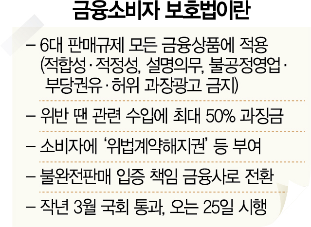

## 2021. 03. 23 뉴스 스크랩

<br>
<br>

### 국민銀 'STM'·하나銀 'AI' 서비스 중단···금융권 금소법發 패닉

---

> [25일 시행…'졸속' 후폭풍 우려]
>
> 감독규정 5일전 발표·세칙도 없어
>
> 업계 "시범 케이스 될라" 몸사려
>
> 피해 고스란히 소비자 몫 될수도

오는 25일 금융소비자보호법 시행을 앞두고 금융권이 대혼란에 빠졌다. 시스템에 변화된 내용을 반영하려면 최소 한 달은 필요한데 금융 당국이 시행을 불과 5영업일 앞두고 감독 규정을 발표한데다 시행세칙은 아직 나오지도 않았기 때문이다. 물론 당국은 금융권의 준비 부족을 고려해 6개월간 시행 유예기간을 둔다고 했지만, 업계에서는 ‘시범 케이스’ 우려에 몸을 한껏 움츠려 피해는 고스란히 소비자에게 돌아갈 것이라는 우려가 확산하고 있다.

 

22일 금융권에 따르면 KB국민은행은 스마트텔러머신(STM)에서 입출금 통장을 개설하는 서비스를 25일부터 4월 말까지 한시 중단한다고 이날 공지했다. STM은 은행 창구를 찾지 않아도 신분증 스캔 등을 통해 통장을 발급받고 비밀번호를 변경할 수 있는 지능형 현금자동입출금기(ATM)다. 지금까지는 약관이나 상품 설명서를 보여주고 넘어갔지만 금소법이 시행되면 상품 설명서를 고객에게 직접 줘야 한다. 하지만 수십 쪽 짜리 설명서를 직접 교부하기는 어려워 e메일로 전달하기 위해 시스템 업그레이드 차원에서 일시 중단을 결정했다.

하나은행도 인공지능(AI) 로보 어드바이저인 ‘하이로보’ 신규 거래를 오는 25일부터 5월 9일까지 한시 중단한다고 공지했다. 하이로보는 사람이 아닌 로봇이 맞춤 펀드를 추천해주는 시스템이다. 하나은행은 “금소법 시행으로 고려해야 할 부분이 많아 한 번에 전산을 변경하는 게 어려워 하이로보 일반펀드 및 개인연금펀드 신규·리밸런싱·진단거래가 일시 중단된다”고 밝혔다. 다만 이미 고객이 보유한 하이로보 펀드 조회 및 추가 입금, 개별 환매는 가능하다.

금소법은 일부 금융 상품에만 적용하던 ‘6대 판매 규제(적합성·적정성 원칙, 설명의무, 불공정영업행위·부당권유행위 ·허위과장광고 금지)’를 모든 금융 상품으로 확대하도록 했다. 위반한 금융사는 관련 수입의 최대 50%까지 ‘징벌적 과징금’을 맞으며 판매 직원에게도 최대 1억 원의 과태료가 부과된다. 소비자는 ‘청약철회권’ ‘위법계약해지권’을 행사할 수 있고 불완전 판매의 입증 책임도 소비자에서 금융사로 전환된다.

금융권의 한 관계자는 “금융 감독 특성상 가장 중요한 것이 시행세칙에 담기는데 그 내용은 아직 발표도 안 됐다”며 “지금까지 나온 시행령, 감독 규정, 당국의 질의응답 자료에도 여전히 의문점이 너무 많다”고 말했다. 그는 “금소법 통과 후 1년이라는 시간이 있었는데 무엇을 했는지 모르겠다”며 “금융 상품 창구 판매보다는 비대면 거래로 유도하고 투자 설명서도 다 출력해서 전달하는 등 최대한 보수적으로 접근할 수밖에 없다”고 지적했다. 카드 업계의 한 관계자도 “감독 규정이 바뀌면 전산·영업 등의 시스템을 바꾸는 데 아무리 빨라야 한 달은 걸린다”며 "그야말로 공황 상태”라고 전했다.

이에 대해 금융당국은 "조만간 시행세칙이 나올 예정"이라며 "다만 업계에서 문제제기하고 있는 세부 내용들은 시행세칙에 담기지 않을 예정"이라고 설명했다.

출처 : https://www.sedaily.com/NewsView/22JWOMG5FR?OutLink=nstand

<br>

**용어 정리**

```text
금융소비자 보호법 
- 6대 판매규제 모든 금융상품에 적용(적합성, 적정성, 설명의무, 불공정영업, 부당권유ㆍ허위 과장광고 금지)
- 위반 땐 관련 수입에 최대 50% 과징금
- 불완전판매 입증 책임 금융사로 전환
- 작년 3월 국회 통과, 오는 25일 시행
```

